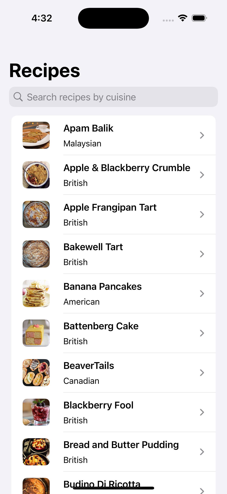
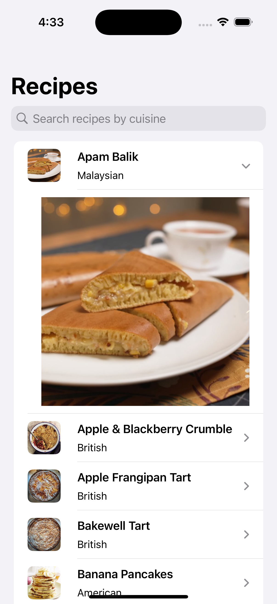
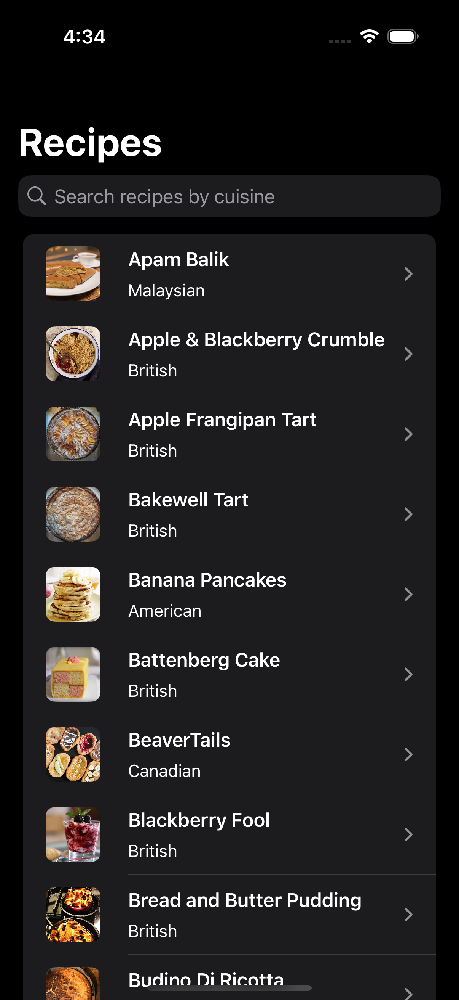
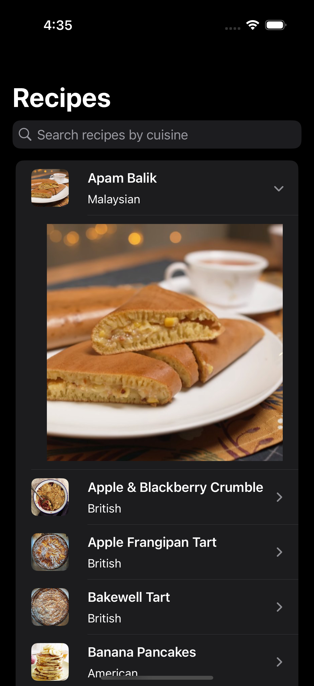

### Summary: Include screen shots or a video of your app highlighting its features

This project displays recipe data in a List. On initial load, it fetches the data from the URL that provides valid data. When pulling to refresh the first time it loads data from the malformed data URL provided. On the second pull to refresh it loads data from the empty data URL provided. It will then continue that pattern on pulling to refresh. It also has a search bar the user can use to type a cuisine to filter the data.  

Image caching was implemented using FileManager. All images that are fetched (which include small and large photos) are cached.  

 

 

### Focus Areas: What specific areas of the project did you prioritize? Why did you choose to focus on these areas?

Image caching and the views took most of the time. I prioritized image cachine because that is a crucial piece of functionality that significantly improves perfomance and reduces overall network calls.  

I also focused on the RecipeListView to get it functioning how I wanted. I implemented it using .searchable to be able to handle large amounts of data and be able to search easily.

### Time Spent: Approximately how long did you spend working on this project? How did you allocate your time?

I spent a total of about 6.5 hours on this project.

- Thursday January 30th - Spent 1 hour on initial project setup. Also set up data retrieval and list view.
- Friday January 31st - Spent 2.5 hours on:
    - Add image fetching and caching
    - Use SwiftUI List instead of custom list I originally implemented
    - Add unit tests
    - Overal view improvements
- Saturday February 1st - Spent 2.5 hours on:
    - Refactor image fetching to be an actor and other general improvements
    - Update list view to improve empty state and error scenarios
    - Add more unit tests
- Monday February 3rd - Spent 30 minutes on:
    - Reviewing code
    - Move screenshots to Screenshots folder
    - Add 3 second delay when fetching recipes and handle loading state

### Trade-offs and Decisions: Did you make any significant trade-offs in your approach?

There were a few design choices I made in regards to the way I wanted to present the list of recipes. I chose to present the recipe data in a List inside a NavigationStack giving me the ability to use .searchable. This is also why the project supports iOS 17 and up. The other option I contemplated was presenting this recipe data in a List with sections, each section being a cuisine type. This would have worked great as well.  

### Weakest Part of the Project: What do you think is the weakest part of your project?

The screens that are presented when the recipe data is malformed or there are no recipes are lacking in content. Each of those screen are just two text views with basic content.

### Additional Information: Is there anything else we should know? Feel free to share any insights or constraints you encountered.

I contemplated implementing a view to present the youtube video in. My solution was going to be to use WKWebView which would require the use of UIViewRepresentable. The requirements call out only using SwiftUI so I wasn't sure if this was desired. Perhaps when reviewing this code with someone I can go about adding that!
