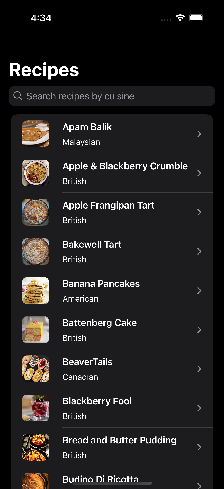
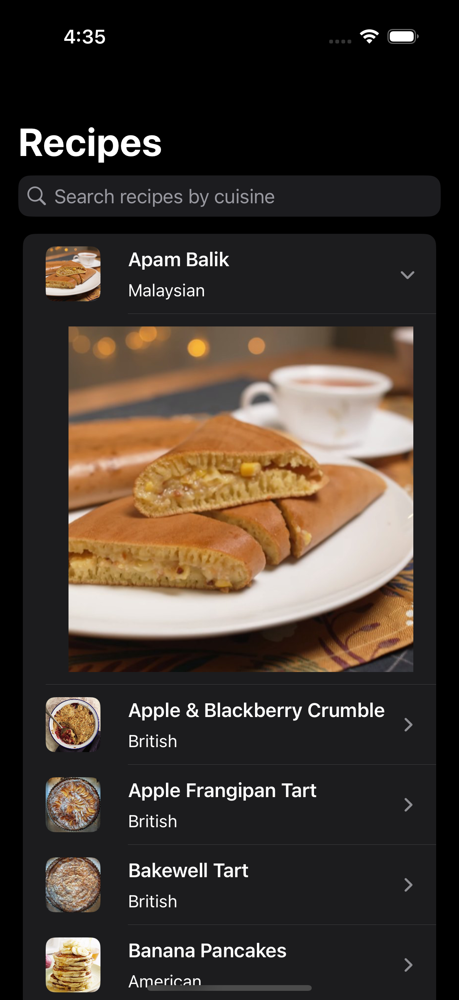

### Summary: Include screen shots or a video of your app highlighting its features

 

 

### Focus Areas: What specific areas of the project did you prioritize? Why did you choose to focus on these areas?

### Time Spent: Approximately how long did you spend working on this project? How did you allocate your time?

- Thursday January 30th - Spent 1 hour on initial project setup. Also set up data retrieval and list view.
- Friday January 31st - Spent 2.5 hours on:
    - Add image fetching and caching
    - Use SwiftUI List instead of custom list I originally implemented
    - Add unit tests
    - Overal view improvements
- Saturday February 1st - Spent 2.5 hours on:
    - Refactor image fetching to be an actor and other general improvements
    - Update list view to improve empty state and error scenarios
    - Add more unit tests

### Trade-offs and Decisions: Did you make any significant trade-offs in your approach?

### Weakest Part of the Project: What do you think is the weakest part of your project?

### Additional Information: Is there anything else we should know? Feel free to share any insights or constraints you encountered.
